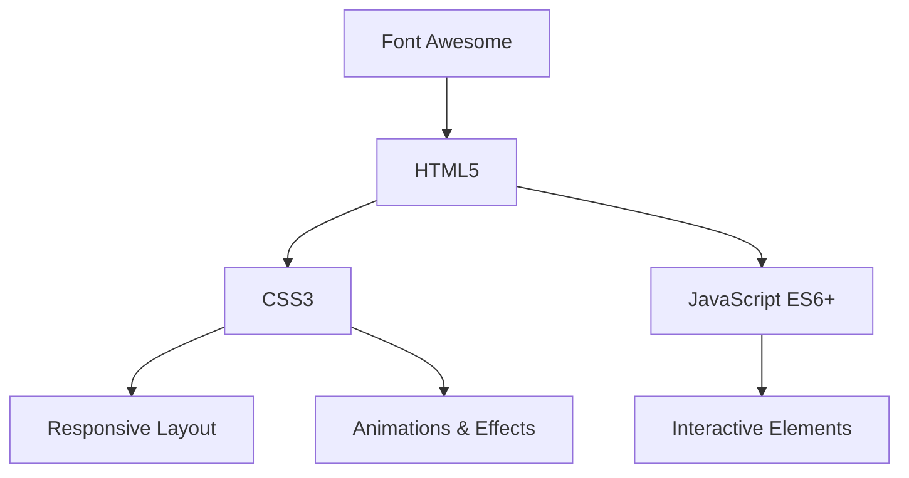

## 1. Architecture Design
单页面应用，纯前端实现，无需后端。

## 2. Technology Description
- 前端：纯 HTML5 + CSS3 + JavaScript (ES6+)
- 样式：自定义 CSS，包含渐变色、动画效果、响应式布局
- 字体：Google Fonts (Playfair Display + Source Sans Pro)
- 图标：Font Awesome
- 部署：可直接部署到任何静态文件服务器

## 3. Route Definitions
| Route | Purpose |
|-------|---------|
| / | 简历主页（单页面应用） |

## 4. API Definitions (if backend exists)
本项目不需要后端 API。

## 5. Server Architecture Diagram (if backend exists)
本项目不需要后端服务器。

## 6. Data Model (if applicable)
### 6.1 Data Model Definition
本项目不需要数据库，数据直接硬编码在 HTML/JavaScript 中。

### 6.2 Data Definition Language
不适用。
