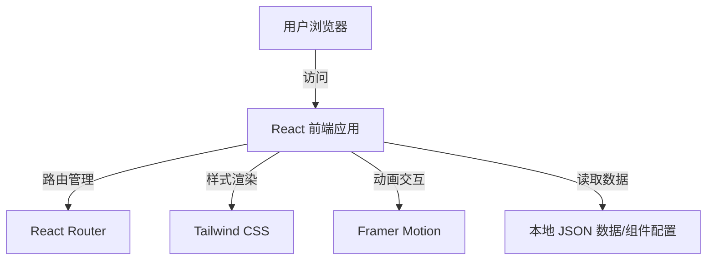

# 技术架构文档 (Technical Architecture)

## 1. 架构设计
本项目采用单页应用 (SPA) 架构，前端渲染，数据存储于本地 JSON 文件或直接硬编码在组件中（极简方案），无需后端数据库。



## 2. 技术栈说明
*   **前端框架**: React @18
*   **构建工具**: Vite (极速开发体验)
*   **样式库**: Tailwind CSS @3 (原子化 CSS，高效构建极简风格)
*   **动画库**: Framer Motion (实现 Apple 风格的高级动效)
*   **路由**: React Router DOM @6
*   **图标库**: Lucide React / Heroicons (极简线条风格)
*   **代码规范**: ESLint + Prettier

## 3. 路由定义
| 路由 | 用途 | 组件 |
|-------|---------|------|
| `/` | 首页 | `Home` |
| `/project/:id` | 作品详情页 | `ProjectDetail` |
| `/about` | 关于页 | `About` |
| `*` | 404 页面 | `NotFound` |

## 4. 数据模型 (前端模拟)
由于没有后端，我们将使用 TypeScript 接口定义数据结构，并在 `src/data/projects.ts` 中存储静态数据。

```typescript
// 项目数据结构定义
export interface Project {
  id: string;
  title: string;
  category: string;
  year: string;
  description: string;
  coverImage: string; // 封面图路径
  images: string[];   // 详情页图片列表
  videoUrl?: string;  // 可选视频链接
  tags: string[];
}

// 个人信息结构定义
export interface Profile {
  name: string;
  role: string;
  bio: string; // 简介
  socialLinks: {
    platform: string;
    url: string;
    icon: string;
  }[];
}
```

## 5. 目录结构
```
src/
├── assets/          # 静态资源 (图片, 字体)
├── components/      # 公共组件 (Button, Navbar, Footer, ProjectCard)
├── pages/           # 页面组件 (Home, ProjectDetail, About, NotFound)
├── data/            # 静态数据 (projects.ts, profile.ts)
├── hooks/           # 自定义 Hooks (useScrollReveal, etc.)
├── layouts/         # 布局组件 (MainLayout)
├── styles/          # 全局样式 (index.css)
├── App.tsx          # 根组件
└── main.tsx         # 入口文件
```
