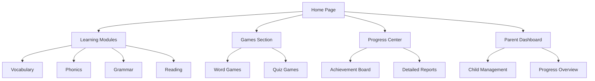

## 1. Product Overview
An interactive English learning app designed for children aged 4-12, making language learning fun through games, stories, and activities.
- Provides engaging, age-appropriate content to build vocabulary, pronunciation, and basic grammar skills
- Targets parents and educators seeking an effective, entertaining way to supplement English education

## 2. Core Features

### 2.1 User Roles
| Role | Registration Method | Core Permissions |
|------|---------------------|------------------|
| Child User | Parent registration | Access learning content, play games, track progress |
| Parent User | Email registration | Manage child accounts, monitor progress, customize learning path |

### 2.2 Feature Module
1. **Home Page**: Dashboard, learning modules, progress tracking
2. **Learning Modules**: Vocabulary, Phonics, Grammar, Reading
3. **Games Section**: Interactive games for skill practice
4. **Progress Center**: Detailed reports and achievements
5. **Parent Dashboard**: Child progress overview, settings

### 2.3 Page Details
| Page Name | Module Name | Feature description |
|-----------|-------------|---------------------|
| Home Page | Dashboard | Personalized learning path, daily challenges, recent activity |
| Home Page | Navigation | Access to all app sections, profile settings |
| Learning Modules | Vocabulary | Interactive flashcards, audio pronunciation, visual aids |
| Learning Modules | Phonics | Sound-letter association, pronunciation practice |
| Learning Modules | Grammar | Basic rules with interactive exercises |
| Learning Modules | Reading | Leveled stories with audio support |
| Games Section | Word Games | Matching, spelling, memory games |
| Games Section | Quiz Games | Multiple choice, fill-in-the-blank quizzes |
| Progress Center | Achievement Board | Badges, levels, completion status |
| Progress Center | Detailed Reports | Skill-specific progress, time spent, recommendations |
| Parent Dashboard | Child Management | Add/edit child profiles, set learning goals |
| Parent Dashboard | Progress Overview | At-a-glance progress reports, skill strengths/weaknesses |

## 3. Core Process
Child users log in and are presented with their personalized learning dashboard. They can choose from various learning modules or play games to practice skills. As they complete activities, their progress is tracked and achievements are unlocked. Parents can monitor their child's progress through the parent dashboard and adjust learning settings as needed.

## 4. User Interface Design
### 4.1 Design Style
- Primary colors: Bright blue (#4A90E2), cheerful yellow (#F5A623), vibrant green (#7ED321)
- Secondary colors: Soft purple (#9013FE), gentle pink (#FF6B6B)
- Button style: Rounded corners, 3D effect with subtle shadows, interactive feedback
- Font: Playful sans-serif (Nunito), large clear text for readability
- Layout style: Card-based with ample white space, playful illustrations
- Icon style: Cartoonish, friendly, colorful with simple shapes

### 4.2 Page Design Overview
| Page Name | Module Name | UI Elements |
|-----------|-------------|-------------|
| Home Page | Dashboard | Colorful cards for each module, animated progress indicators, daily challenge banner with confetti effect |
| Learning Modules | Vocabulary | Flashcards with flip animation, audio play buttons, visual illustrations, progress bars |
| Games Section | Word Games | Bright game boards, animated characters, reward animations for correct answers |
| Progress Center | Achievement Board | Interactive badge collection, level up animations, progress visualization with charts |
| Parent Dashboard | Progress Overview | Clean data visualization, skill heat maps, weekly progress trends |

### 4.3 Responsiveness
- Mobile-first design with touch optimization
- Adaptive layout for different screen sizes
- Larger touch targets for younger children
- Simplified navigation on smaller screens
- Full functionality preserved across devices

### 4.4 3D Scene Guidance
- No 3D scenes required for core functionality
- Optional 3D elements for game animations and rewards
- Lightweight implementation to ensure performance on all devices