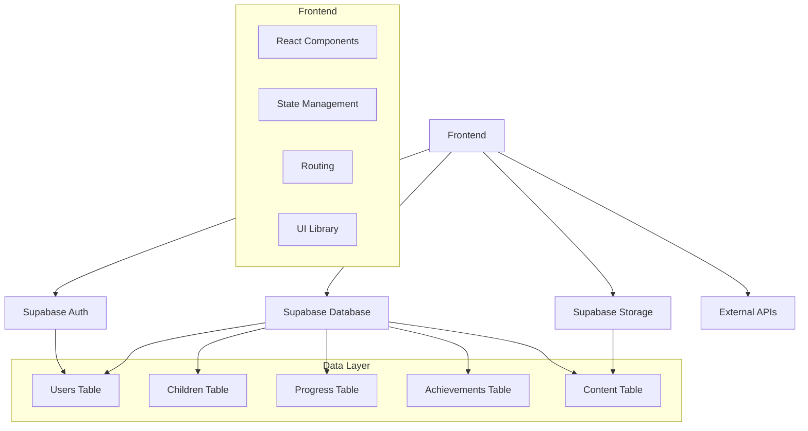
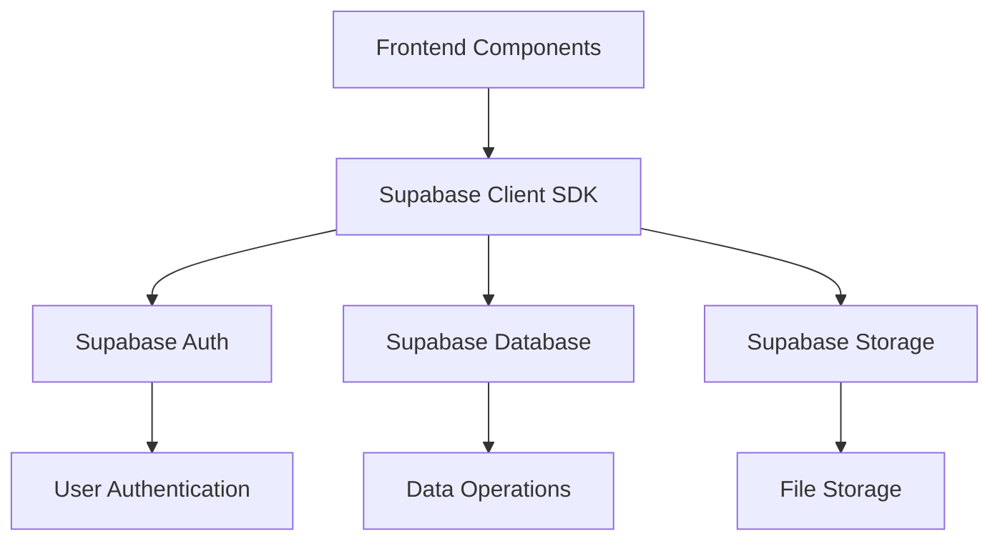
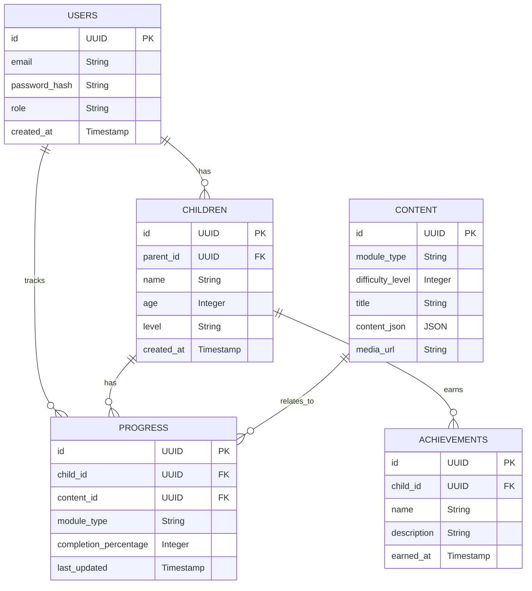

## 1. Architecture Design


## 2. Technology Description
- Frontend: React@18 + TypeScript + Tailwind CSS@3 + Vite
- Initialization Tool: vite-init
- Backend: Supabase (Authentication, Database, Storage)
- Database: Supabase (PostgreSQL)
- Additional Libraries: 
  - React Router DOM for navigation
  - Zustand for state management
  - Lucide React for icons
  - Chart.js for progress visualization

## 3. Route Definitions
| Route | Purpose |
|-------|---------|
| / | Home Page with dashboard |
| /learning | Learning Modules section |
| /learning/vocabulary | Vocabulary learning module |
| /learning/phonics | Phonics learning module |
| /learning/grammar | Grammar learning module |
| /learning/reading | Reading learning module |
| /games | Games Section |
| /games/word | Word games |
| /games/quiz | Quiz games |
| /progress | Progress Center |
| /progress/achievements | Achievement Board |
| /progress/reports | Detailed Reports |
| /parent | Parent Dashboard |
| /parent/manage | Child Management |
| /parent/reports | Progress Overview |
| /auth | Authentication pages |

## 4. API Definitions
### 4.1 Authentication APIs
- Supabase Auth for user registration and login
- Parent registration with email/password
- Child accounts linked to parent accounts

### 4.2 Data APIs
- User data: CRUD operations for parent and child profiles
- Progress data: Track and update learning progress
- Achievement data: Manage badges and achievements
- Content data: Access learning materials and game content

## 5. Server Architecture Diagram


## 6. Data Model
### 6.1 Data Model Definition


### 6.2 Data Definition Language
```sql
-- Users Table
CREATE TABLE users (
  id UUID PRIMARY KEY DEFAULT gen_random_uuid(),
  email VARCHAR(255) UNIQUE NOT NULL,
  password_hash VARCHAR(255) NOT NULL,
  role VARCHAR(50) DEFAULT 'parent',
  created_at TIMESTAMP DEFAULT now()
);

-- Children Table
CREATE TABLE children (
  id UUID PRIMARY KEY DEFAULT gen_random_uuid(),
  parent_id UUID REFERENCES users(id),
  name VARCHAR(100) NOT NULL,
  age INTEGER,
  level VARCHAR(50) DEFAULT 'beginner',
  created_at TIMESTAMP DEFAULT now()
);

-- Progress Table
CREATE TABLE progress (
  id UUID PRIMARY KEY DEFAULT gen_random_uuid(),
  child_id UUID REFERENCES children(id),
  content_id UUID REFERENCES content(id),
  module_type VARCHAR(50) NOT NULL,
  completion_percentage INTEGER DEFAULT 0,
  last_updated TIMESTAMP DEFAULT now()
);

-- Achievements Table
CREATE TABLE achievements (
  id UUID PRIMARY KEY DEFAULT gen_random_uuid(),
  child_id UUID REFERENCES children(id),
  name VARCHAR(100) NOT NULL,
  description TEXT,
  earned_at TIMESTAMP DEFAULT now()
);

-- Content Table
CREATE TABLE content (
  id UUID PRIMARY KEY DEFAULT gen_random_uuid(),
  module_type VARCHAR(50) NOT NULL,
  difficulty_level INTEGER DEFAULT 1,
  title VARCHAR(255) NOT NULL,
  content_json JSONB,
  media_url VARCHAR(500)
);

-- Insert sample data
INSERT INTO content (module_type, difficulty_level, title, content_json)
VALUES 
  ('vocabulary', 1, 'Animals', '{"words": [{"word": "cat", "image": "cat.png", "audio": "cat.mp3"}, {"word": "dog", "image": "dog.png", "audio": "dog.mp3"}]}'),
  ('phonics', 1, 'Letter A', '{"sounds": [{"letter": "A", "sound": "a", "words": ["apple", "ant"]}]}'),
  ('grammar', 1, 'Basic Greetings', '{"exercises": [{"question": "Hello ____ name is", "answer": "my"}]}'),
  ('reading', 1, 'The Cat and the Mouse', '{"text": "Once upon a time, there was a cat and a mouse...", "audio": "story1.mp3"}');

-- Grant permissions
GRANT SELECT ON users, children, progress, achievements, content TO anon;
GRANT ALL PRIVILEGES ON users, children, progress, achievements, content TO authenticated;
```