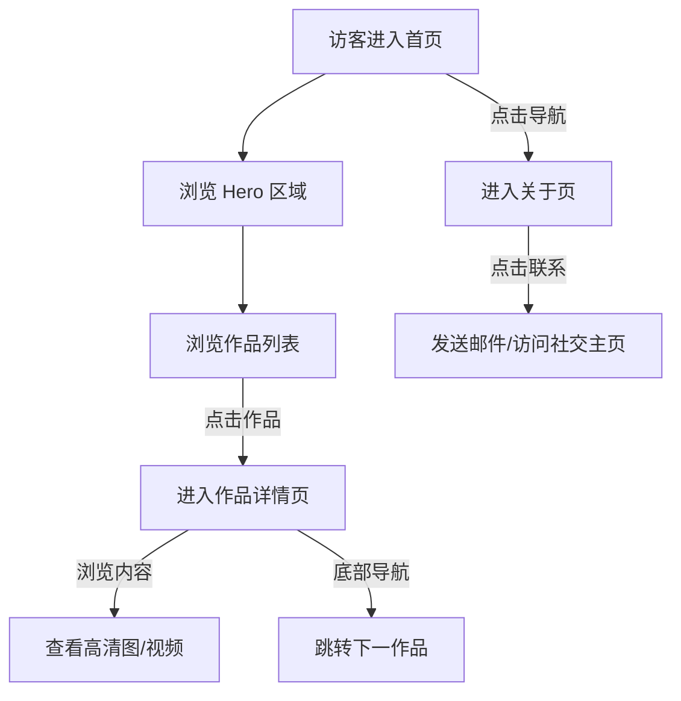

# 产品需求文档 (PRD)

## 1. 产品概述
本项目旨在创建一个极具苹果设计风格（Apple-style）的极简个人作品集网站。
核心目标是通过极致的排版、流畅的动效和留白艺术，高雅地展示创作者的个人作品，传达专业与高级感。

## 2. 核心功能

### 2.1 用户角色
本网站为静态展示站，主要面向访客，无复杂的用户登录系统。

| 角色 | 注册方式 | 核心权限 |
|------|----------|----------|
| 访客 | 无需注册 | 浏览作品、查看详情、阅读关于信息 |

### 2.2 功能模块
1. **首页 (Home)**: 极简的个人介绍（Hero Section），精选作品网格展示。
2. **作品详情页 (Project Detail)**: 沉浸式展示单个作品，包含高清大图、视频、设计理念及背景介绍。
3. **关于页 (About)**: 个人履历、联系方式、社交链接。

### 2.3 页面详情
| 页面名称 | 模块名称 | 功能描述 |
| page name | module name | feature description |
|-----------|-------------|---------------------|
| 首页 | 导航栏 | 顶部固定或自动隐藏，包含 Logo 和简洁的菜单链接。 |
| 首页 | Hero 区域 | 大字号标语，配合微妙的入场动画，简短自我介绍。 |
| 首页 | 作品画廊 | 网格布局或瀑布流展示作品缩略图，悬停时有优雅的放大或阴影效果。 |
| 首页 | 页脚 | 版权信息，简洁的社交图标。 |
| 作品详情页 | 顶部概览 | 全屏封面图或视频，项目标题，核心属性（年份、角色、类别）。 |
| 作品详情页 | 内容区 | 图文混排，支持宽屏图片、轮播图、嵌入视频，注重阅读体验。 |
| 作品详情页 | 底部导航 | “下一个项目”/“上一个项目” 快速跳转。 |
| 关于页 | 个人信息 | 头像/照片，详细的个人简介，技能列表。 |
| 关于页 | 联系方式 | 邮箱链接（点击复制或跳转邮件客户端），社交媒体链接。 |

## 3. 核心流程
访客进入首页 -> 浏览作品列表 -> 点击感兴趣的作品 -> 进入详情页深度阅读 -> 通过底部导航浏览更多作品 或 点击“关于”了解作者。

## 4. 用户界面设计 (UI Design)

### 4.1 设计风格
*   **核心理念**: Less is More. 模仿 Apple 官网的极致简约。
*   **配色**:
    *   主色: 纯黑 (#000000) 或 深灰 (#1D1D1F) 用于文字。
    *   背景: 纯白 (#FFFFFF) 或 极浅灰 (#F5F5F7) 用于区分区块。
    *   强调色: 极其克制，仅在链接或按钮交互时使用蓝色 (#0071E3) 或保持单色。
*   **字体**: 使用系统字体栈，优先 San Francisco (macOS) / Inter，字重对比鲜明（超细 vs 超粗）。
*   **布局**: 宽大的页边距，居中对齐为主，呼吸感强。
*   **动效**: 页面元素随滚动缓慢浮现 (Scroll Reveal)，图片视差滚动 (Parallax)，平滑的过渡效果。

### 4.2 页面设计概览
| 页面名称 | 模块名称 | UI 元素 |
|-----------|-------------|-------------|
| 首页 | 全局 | 磨砂玻璃效果 (Backdrop Blur) 的导航栏。 |
| 首页 | 作品卡片 | 大圆角 (20px+)，无边框，深邃柔和的阴影 (Drop Shadow)，悬停时轻微上浮。 |
| 详情页 | 图片展示 | 图片边缘可能是直角或微圆角，支持 Lightbox 查看大图。 |

### 4.3 响应式设计
*   **Desktop First**: 优先保证在大屏幕上的沉浸式体验。
*   **Mobile Adaptive**: 移动端自动堆叠布局，字体大小适度调整，导航栏变为汉堡菜单或底部栏。
*   **Touch Optimization**: 移动端支持滑动手势（如轮播图）。
