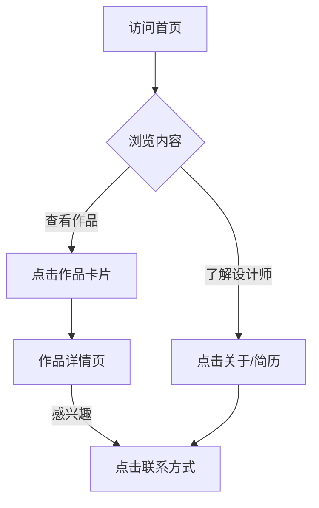

## 1. 产品概述
这是一个专为 UX 设计师打造的高端作品集网站，旨在通过最新的“液态玻璃（Liquid Glass）”风格展示其设计才华。网站不仅承载作品，其本身就是一个体现极致用户体验和视觉美学的作品。
- **核心目标**：通过独特的视觉语言（液态、玻璃质感、光影）和流畅的交互，给访问者留下深刻印象，展示设计师的专业能力。
- **目标受众**：潜在雇主、客户、设计同行。

## 2. 核心功能

### 2.1 用户角色（如适用）
| 角色 | 注册方式 | 核心权限 |
|------|----------|----------|
| 访客 | 无需注册 | 浏览所有页面，查看作品详情，联系设计师 |

### 2.2 功能模块
1. **首页 (Home)**: 沉浸式 Hero 区域（液态动效），精选作品展示（玻璃卡片），关于我摘要，页脚联系方式。
2. **作品详情页 (Case Study)**: 项目背景，设计过程，高保真界面展示，交互演示，相关推荐。
3. **关于页 (About)**: 个人经历，技能树，设计理念，简历下载。
4. **404 页**: 趣味性的液态动效引导返回首页。

### 2.3 页面详情
| 页面名称 | 模块名称 | 功能描述 |
|----------|----------|----------|
| 首页 | Hero Section | 全屏液态背景动效，跟随鼠标流动的光影，简洁有力的自我介绍文案。 |
| 首页 | 作品画廊 | 采用玻璃拟态（Glassmorphism）卡片展示作品封面，悬停时产生深度变化和光效流转。 |
| 首页 | 导航栏 | 顶部悬浮磨砂玻璃导航，滚动时动态模糊背景。 |
| 作品详情页 | 案例内容 | 沉浸式阅读体验，支持大图浏览、视频播放、交互原型嵌入。 |
| 全局 | 鼠标交互 | 自定义光标，跟随鼠标的液态光斑，点击时的波纹反馈。 |

## 3. 核心流程
用户访问首页 -> 被 Hero 动效吸引 -> 浏览精选作品 -> 点击卡片进入详情页 -> 深入阅读案例 -> 通过底部/导航联系设计师。

## 4. 用户界面设计

### 4.1 设计风格
- **核心风格**: **Liquid Glass (液态玻璃) / Glassmorphism 2.0**。强调通透感、多层模糊、流动的光影和细腻的边缘高光。
- **配色**: Apple 风格的极简白/深色模式。背景使用流动的极光色（Aurora gradients）或金属液态光泽。
- **字体**: 系统默认无衬线字体 (San Francisco / Inter)，字重对比强烈，排版呼吸感强。
- **质感**: 磨砂玻璃 (Backdrop blur)，噪点纹理 (Noise texture)，彩虹光泽 (Iridescence)。
- **动效**: 物理模拟的流体运动，弹性滚动，视差效果。

### 4.2 页面设计概览
| 页面名称 | 模块名称 | UI 元素 |
|----------|----------|---------|
| 首页 | Hero | 3D 液态球体或流体背景，大标题，磨砂玻璃 CTA 按钮。 |
| 首页 | 作品列表 | 高度透明的玻璃卡片，边缘发光，悬停时卡片上浮且背景模糊度增加。 |
| 详情页 | 内容区 | 宽幅布局，大图展示，文字排版注重阅读节奏，章节间使用流体分割线。 |

### 4.3 响应式
- **策略**: 桌面优先（Desktop-First），确保在宽屏上展现最佳视觉冲击力，同时完美适配移动端触摸操作。
- **移动端**: 简化动效以保证性能，玻璃卡片堆叠改为纵向流，导航栏变为底部浮动磨砂条。

### 4.4 3D 场景指导
- **环境**: 纯净的实验室光照环境，带有柔和的环境光遮蔽 (AO)。
- **材质**: 物理渲染 (PBR) 的玻璃材质，高折射率 (IOR)，带有色散效果。
- **动态**: 缓慢流动的液态金属或水银质感，对鼠标移动有细腻的粘滞跟随反应。
