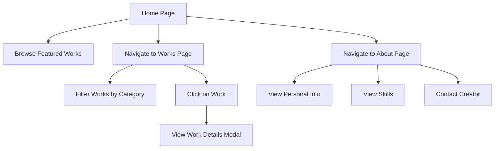

## 1. Product Overview
作品集网站是一个展示个人或团队项目作品的平台，帮助用户展示专业能力和项目经验。
- 主要目的是为创作者提供一个专业的在线展示空间，方便潜在客户或雇主了解其技能和成果。
- 目标用户包括设计师、开发者、摄影师、艺术家等需要展示作品的专业人士。

## 2. Core Features

### 2.1 User Roles
| Role | Registration Method | Core Permissions |
|------|---------------------|------------------|
| Visitor | N/A | Browse and view all works |
| Admin | Local login | Manage works, add/edit/delete projects |

### 2.2 Feature Module
1. **Home page**: hero section, navigation, featured works, about section
2. **Works page**: work grid, filter options, work details modal
3. **About page**: personal/team information, skills, contact details

### 2.3 Page Details
| Page Name | Module Name | Feature description |
|-----------|-------------|---------------------|
| Home page | Hero section | Eye-catching header with name/brand and brief introduction, background animation |
| Home page | Navigation | Responsive menu with links to home, works, and about pages |
| Home page | Featured works | Showcase 3-4 best works with images and brief descriptions |
| Home page | About section | Brief introduction with skills and a call-to-action |
| Works page | Work grid | Masonry or grid layout of all works with thumbnail images |
| Works page | Filter options | Filter works by category (e.g., web design, graphic design, development) |
| Works page | Work details modal | Full-size images, detailed description, technologies used, project link |
| About page | Personal/team info | Detailed bio, professional experience, education |
| About page | Skills | Visual representation of skills (e.g., progress bars, skill cards) |
| About page | Contact details | Email, social media links, contact form |

## 3. Core Process
1. Visitor lands on home page
2. Visitor browses featured works or navigates to works page
3. Visitor filters works by category on works page
4. Visitor clicks on a work to view details in modal
5. Visitor navigates to about page to learn more about the creator
6. Visitor contacts the creator through provided contact information

## 4. User Interface Design
### 4.1 Design Style
- Primary color: #3b82f6 (blue)
- Secondary color: #f43f5e (pink)
- Accent color: #10b981 (green)
- Button style: Rounded corners, subtle shadow, hover effects
- Font: Inter for body text, Playfair Display for headings
- Font sizes: h1 (3rem), h2 (2.5rem), h3 (2rem), body (1rem)
- Layout style: Clean, minimalist with generous whitespace, card-based design
- Icon style: Line icons with consistent stroke width

### 4.2 Page Design Overview
| Page Name | Module Name | UI Elements |
|-----------|-------------|-------------|
| Home page | Hero section | Full-height background with subtle gradient, centered text with animated entrance, call-to-action button |
| Home page | Navigation | Fixed top navigation with logo, links, and mobile menu toggle |
| Home page | Featured works | Card grid with hover effects, image zoom, and brief descriptions |
| Home page | About section | Two-column layout with text and profile image, skill badges |
| Works page | Work grid | Masonry layout with varying image sizes, hover effects, category tags |
| Works page | Filter options | Horizontal filter bar with category buttons, active state indicator |
| Works page | Work details modal | Full-screen modal with image carousel, project details, and external link button |
| About page | Personal/team info | Timeline of experience, education section with cards |
| About page | Skills | Circular progress indicators for technical skills, skill category grouping |
| About page | Contact details | Contact form with validation, social media icon links, email address |

### 4.3 Responsiveness
- Desktop-first approach
- Mobile-adaptive design with breakpoints at 768px and 480px
- Touch optimization for mobile devices
- Collapsible navigation menu on mobile
- Responsive grid layout that adjusts based on screen size

### 4.4 3D Scene Guidance
- No 3D scenes required for this project