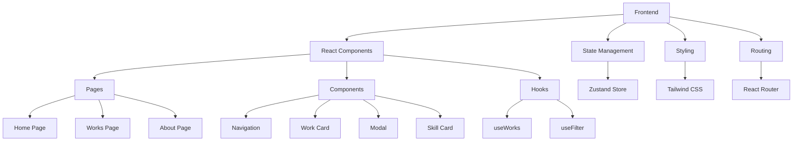
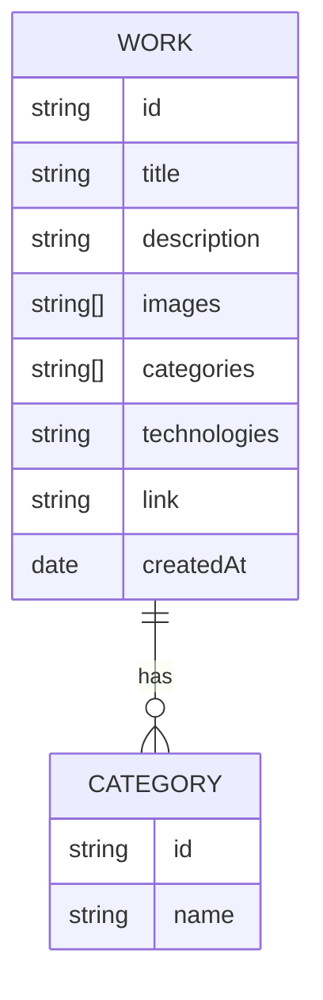

## 1. Architecture Design


## 2. Technology Description
- Frontend: React@18 + TypeScript + Tailwind CSS@3 + Vite
- Initialization Tool: vite-init
- Backend: None (static site with client-side routing)
- Database: None (static data stored in JSON files)
- Deployment: Static hosting (Vercel, Netlify, GitHub Pages)

## 3. Route Definitions
| Route | Purpose |
|-------|---------|
| / | Home page with hero section and featured works |
| /works | Works page with grid layout and filter options |
| /about | About page with personal info and skills |

## 4. API Definitions
- No backend API required. All data will be stored locally in JSON files.

## 5. Server Architecture Diagram
- Not applicable for static site

## 6. Data Model
### 6.1 Data Model Definition


### 6.2 Data Definition Language
- No database required. Data will be stored in JSON files:

```json
// src/data/works.json
[
  {
    "id": "1",
    "title": "Project 1",
    "description": "Description of project 1",
    "images": ["image1.jpg", "image2.jpg"],
    "categories": ["web design", "development"],
    "technologies": "React, TypeScript, Tailwind CSS",
    "link": "https://example.com/project1",
    "createdAt": "2023-01-01"
  }
]

// src/data/categories.json
[
  {
    "id": "1",
    "name": "web design"
  },
  {
    "id": "2",
    "name": "graphic design"
  },
  {
    "id": "3",
    "name": "development"
  }
]
```